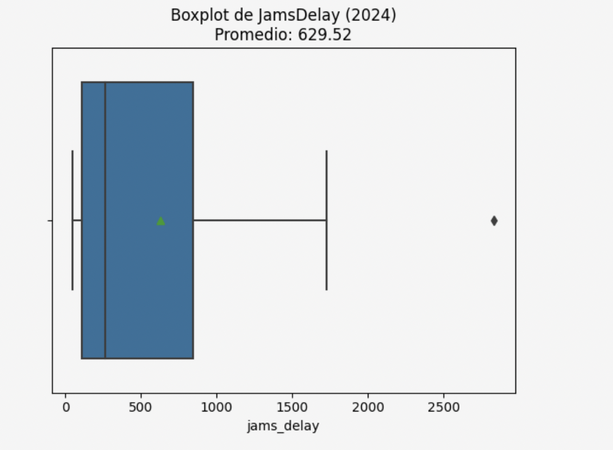
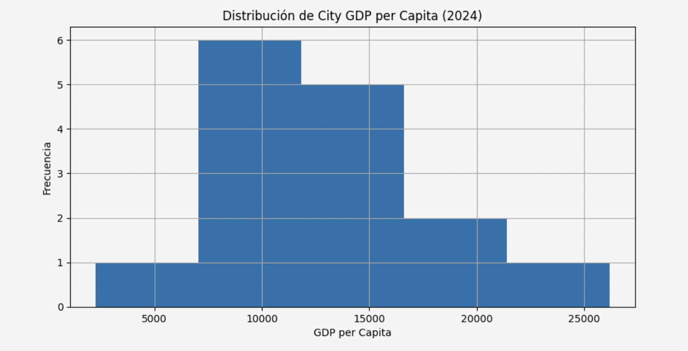
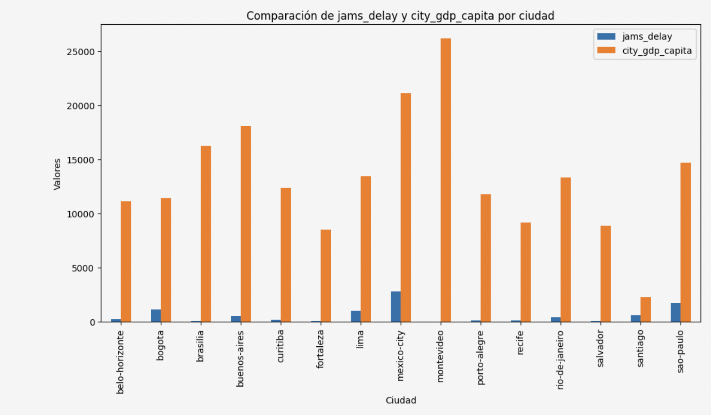

<h1 align="center">🌍 Urban Mobility & Economic Analysis</h1>

  <i>Data Analysis Project • Python • Economic Insights</i>

<h2>🧠 Overview</h2>

Exploring how urban traffic congestion correlates with economic performance across cities.

This project combines mobility and economic datasets to uncover patterns that impact productivity, efficiency, and urban development.

<h2>📊 Visual Insights</h2>

  
  

  

<h2>🔍 What I Did</h2>

<ul>
  <li>Data cleaning & preprocessing (Python, Pandas)</li>
  <li>Data integration: merged mobility & economic datasets</li>
  <li>Exploratory Data Analysis (EDA)</li>
  <li>Correlation analysis across key indicators</li>
</ul>

<h2>📈 Key Findings</h2>

<ul>
  <li><b>Traffic congestion correlates with economic activity patterns</b></li>
  <li>Cities with high congestion do not always show high efficiency</li>
  <li>Mobility inefficiencies reflect deeper structural challenges</li>
  <li>Traffic metrics can act as proxies for economic performance</li>
</ul>

<h2>📌 Business Perspective</h2>

Urban mobility is not just a transportation issue — <b>it is an economic signal.</b>

<ul>
  <li>Smarter urban planning</li>
  <li>Transportation optimization</li>
  <li>Data-driven public policy</li>
</ul>

<h2>🛠 Tech Stack</h2>

Python • Pandas • Matplotlib

<h2>📁 Project Files</h2>

<code>S5_ladb_mobility_economy_project_student.ipynb</code>

<h2>🎯 Final Insight</h2>

<b>Better mobility = better economic efficiency.</b>  
Data reveals where cities are losing productivity — and where strategic intervention is needed.

  <i>Built with a data-driven mindset and a focus on real-world impact.</i>

